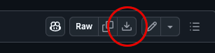

[//]: # (README.md)
[//]: # (Copyright © 2025 Joel A Mussman. All rights reserved.)
[//]: #


# K8s skillsoft Lab Fixes for Building Kubernetes Skills

## Overview

There are three separate issues with the virtual lab computers for the *skillsoft*
Building Kubernetes Skills course:

1. The Microsoft Azure computers behind the Learn On Demand lab environment do not have a
correct key map for Apple MacOS.
This blocks control-C (^C) from working.
This issue does not affect Microsoft Windows clients.
Follow the utilization instructions at this repo to install a .Xmodmap key map file
on the Ubuntu virtual computers if your desktop is a MacOS computer:
[https://github.com/jmussman/k8s-skillsoft-mac-xmodmap](https://github.com/jmussman/k8s-skillsoft-mac-xmodmap).

1. GitHub enforced end-of-life on the Kubernetes repositories it was hosting.
The lab instructions for installing Kubernetes reference these repositories and they cannot be found.
The instructions below identify where the repositories are used and replace them with the newer
public versions.

1. The three-computer Kubernetes cluster that is preinstalled for the bulk of the class has
expired self-signed TLS certificates, since current standards insist they must expire after 365 days.
Chrome is trying to reduce this to 90 days.
The instructions to update certificates are hard to find and poorly stated, although they do exist.
A script to replace the certificates, with improvements to the process, has been left at the
GitHub repository [https://github.com/jmussman/k8s-renew-certificates](https://github.com/jmussman/k8s-renew-certificates).
The README.md file at that repository will explain how to use it, and exactly how it works.

Instructors: see the [DEMO Instructions](#instructor-demo-fixes) for the corresponding fixes for the demonstrations.

## Instructions

### Lab 1 - pre-lab setup

1. When the lab environment starts, you will be left on the virtual computer named "Ubuntu Desktop - 18.04 - vILT Lab: Kubernetes-Master".
On the right side click on the tab "Resources".
Make very sure you change the virtual computer and start in the virtual machine where the name ends with "vILT - Kubernetes Install Demo".
The lab will not work correctly on any of the other computers.

### Fixes

1. Task 2, Page 3, step 1, instruction 2: This command primes the computer with the signing key for the
Google Kubernetes packages, which were removed when end-of-life was reached.
Replace the curl command with these two commands for the keys for the new
packages at Google and https://pkgs.k8s.io (# is the root prompt):
```
# curl -fsSL https://dl-ssl.google.com/linux/linux_signing_key.pub | sudo apt-key add -
# curl -fsSL https://pkgs.k8s.io/core:/stable:/v1.28/deb/Release.key | sudo apt-key add -
```

1. Task 2, Page 3, step 1, instruction 3: Replace the echo command with this updated command for
the new package location:
```
# echo "deb https://pkgs.k8s.io/core:/stable:/v1.28/deb/ /" | sudo tee /etc/apt/sources.list.d/kubernetes.list
```

1. Task 5, Page 9, Step 10: The CIDR network is wrong, replace the kubeadm command with this:
```
root@Udesktop:~# kubeadm init --pod-network-cidr=10.20.0.0/12
```

1. Task 7, Page 11, step 1: On the right-side "Resources" tab
switch to the computer that the name ends with
"vILT Lab: Kubernetes Install Demo - Wor".
The word "Worker" is cut off after the "r".

1. Task 8, Page 12, step 1, instruction 2: This command primes the computer with the signing key for the
Google Kubernetes packages, which were removed when end-of-life was reached.
Replace the curl command with these two commands for the keys for the new
packages at Google and https://pkgs.k8s.io (# is the root prompt):
```
# curl -fsSL https://dl-ssl.google.com/linux/linux_signing_key.pub | sudo apt-key add -
# curl -fsSL https://pkgs.k8s.io/core:/stable:/v1.28/deb/Release.key | sudo apt-key add -
```

1. Task 8, Page 12, step 1, instruction 3: Replace the echo command with this updated command for
the new package location:
```
# echo "deb https://pkgs.k8s.io/core:/stable:/v1.28/deb/ /" | sudo tee /etc/apt/sources.list.d/kubernetes.list
```

1. Proceed with the remainder of the lab.

### Lab 2 - Pre-lab instructions

1. In the right-side "Resources" tab launch and sign on to the three other computers:
"Ubuntu Desktop - 18.04 - vILT Lab: Kubernetes - Master", "... Kubernetes - Worker1", and
"... Kubernetes - Worker2".

1. Switch back to the "Master" comptuer.

1. Open a terminal window and execute the following command (labadmin@master:~$ is the prompt, and it should fail):
```
labadmin@master:~$ kubectl cluster-info
```

1. The self-signed TLS certificates for this installation have expired and must be renewed to
process.
In Firefox on the virtual computer go to the GitHub repository
[https://github.com/jmussman/k8s-renew-certificates](https://github.com/jmussman/k8s-renew-certificates).

1. click on the file in the list "k8s-renew-certificates.sh".

1. Click on the download button to bring this file to the local computer.


1. Go back to the terminal window.

1. Switch to the Downloads folder:
```
labadmin@master:~$ cd ~/Downloads
```

1. Execute the script as the labadmin user to renew the self-signed TLS certificates:
```
labadmin@master:~$ bash ./kb8s-renew-certificates.sh
```

1. Verify that the cluster is up and running properly with the kubectl command,
you should see output that indicates all of the nodes are ready:
```
labadmin@master:~$ kubectl get nodes
NAME      STATUS   ROLES                  AGE    VERSION
master    Ready    control-plane,master   622d   v1.23.5
worker1   Ready    <none>                 622d   v1.23.5
worker2   Ready    <none>                 622d   v1.23.5
```

1. Proceed with Task 1 in Lab 2.

 This is the end of the lab fixes!

## See Also

* The Kubernetes installation scripts for various platforms at https://github.com/jmussman/k8s-install-scripts

<br><br>

# Instructor DEMO fixes

## Instructions
### Demo 1 - pre-demo instructions

1. When the lab environment starts, you will be left on the virtual computer named "Ubuntu Desktop - 18.04 - vILT Lab: Kubernetes-Master".
On the right side click on the tab "Resources".
Make very sure you change the virtual computer and start in the virtual machine where the name ends with "vILT - Kubernetes Install Demo".
The lab will not work correctly on any of the other computers.

### Fixes

1. Page 3, step 4 (starts on page 2), instruction 2:
This command primes the computer with the signing key for the
Google Kubernetes packages, which were removed when end-of-life was reached.
Replace the curl command with these two commands for the keys for the new
packages at Google and https://pkgs.k8s.io (# is the root prompt):
```
# curl -fsSL https://dl-ssl.google.com/linux/linux_signing_key.pub | sudo apt-key add -
# curl -fsSL https://pkgs.k8s.io/core:/stable:/v1.28/deb/Release.key | sudo apt-key add -
```

1. Page 3, step 4, instruction 3: Replace the echo command with this updated command for
the new package location:
```
# echo "deb https://pkgs.k8s.io/core:/stable:/v1.28/deb/ /" | sudo tee /etc/apt/sources.list.d/kubernetes.list
```

1. Page 9, Step 18: The CIDR network is wrong, replace the kubeadm command with this:
```
root@Udesktop:~# kubeadm init --pod-network-cidr=10.20.0.0/12
```

1. Page 10, step 24: On the right-side "Resources" tab
switch to the computer that the name ends with
"vILT Lab: Kubernetes Install Demo - Wor".
The word "Worker" is cut off after the "r".

1. Page 11, step 27, instruction 2: This command primes the computer with the signing key for the
Google Kubernetes packages, which were removed when end-of-life was reached.
Replace the curl command with these two commands for the keys for the new
packages at Google and https://pkgs.k8s.io (# is the root prompt):
```
# curl -fsSL https://dl-ssl.google.com/linux/linux_signing_key.pub | sudo apt-key add -
# curl -fsSL https://pkgs.k8s.io/core:/stable:/v1.28/deb/Release.key | sudo apt-key add -
```

1. Page 11, step 27, instruction 3: Replace the echo command with this updated command for
the new package location:
```
# echo "deb https://pkgs.k8s.io/core:/stable:/v1.28/deb/ /" | sudo tee /etc/apt/sources.list.d/kubernetes.list
```

1. Proceed with the remainder of the demonstration.

### Demo 2 - Pre-task instructions

1. In the right-side "Resources" tab launch and sign on to the three other computers:
"Ubuntu Desktop - 18.04 - vILT Lab: Kubernetes - Master", "... Kubernetes - Worker1", and
"... Kubernetes - Worker2".

1. Switch back to the "Master" comptuer.

1. Open a terminal window and execute the following command (labadmin@master:~$ is the prompt, and it should fail):
```
labadmin@master:~$ kubectl cluster-info
```

1. The self-signed TLS certificates for this installation have expired and must be renewed to
process.
In Firefox on the virtual computer go to the GitHub repository
[https://github.com/jmussman/k8s-renew-certificates](https://github.com/jmussman/k8s-renew-certificates).

1. click on the file in the list "k8s-renew-certificates.sh".

1. Click on the download button to bring this file to the local computer.


1. Go back to the terminal window.

1. Switch to the Downloads folder:
```
labadmin@master:~$ cd ~/Downloads
```

1. Execute the script as the labadmin user to renew the self-signed TLS certificates:
```
labadmin@master:~$ bash ./kb8s-renew-certificates.sh
```

1. Verify that the cluster is up and running properly with the kubectl command,
you should see output that indicates all of the nodes are ready:
```
labadmin@master:~$ kubectl get nodes
NAME      STATUS   ROLES                  AGE    VERSION
master    Ready    control-plane,master   622d   v1.23.5
worker1   Ready    <none>                 622d   v1.23.5
worker2   Ready    <none>                 622d   v1.23.5
```

1. Proceed with the demonstration.

## License

The code is licensed under the MIT license. You may use and modify all or part of it as you choose, as long as attribution to the source is provided per the license. See the details in the [license file](./LICENSE.md) or at the [Open Source Initiative](https://opensource.org/licenses/MIT).

<hr>
Copyright © 2025 Joel A Mussman. All rights reserved.